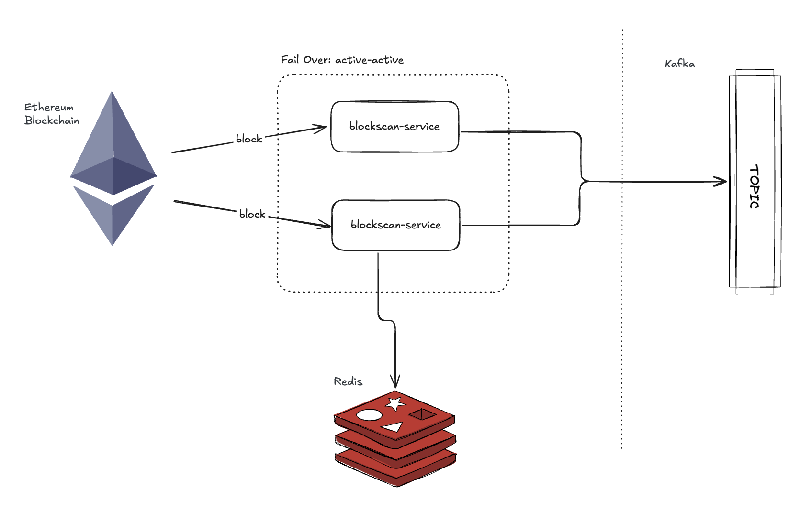
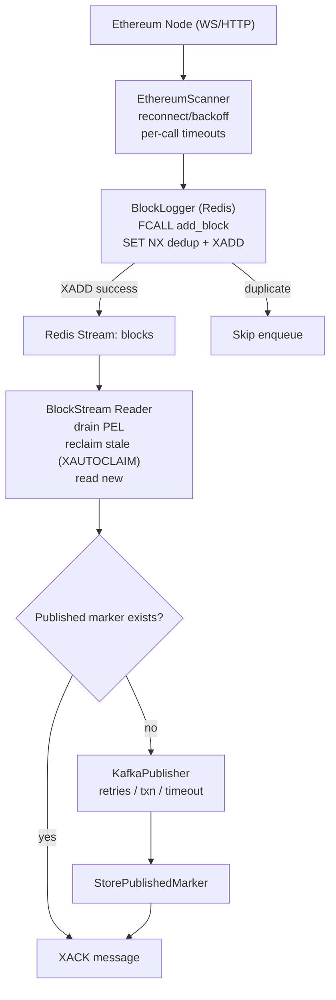
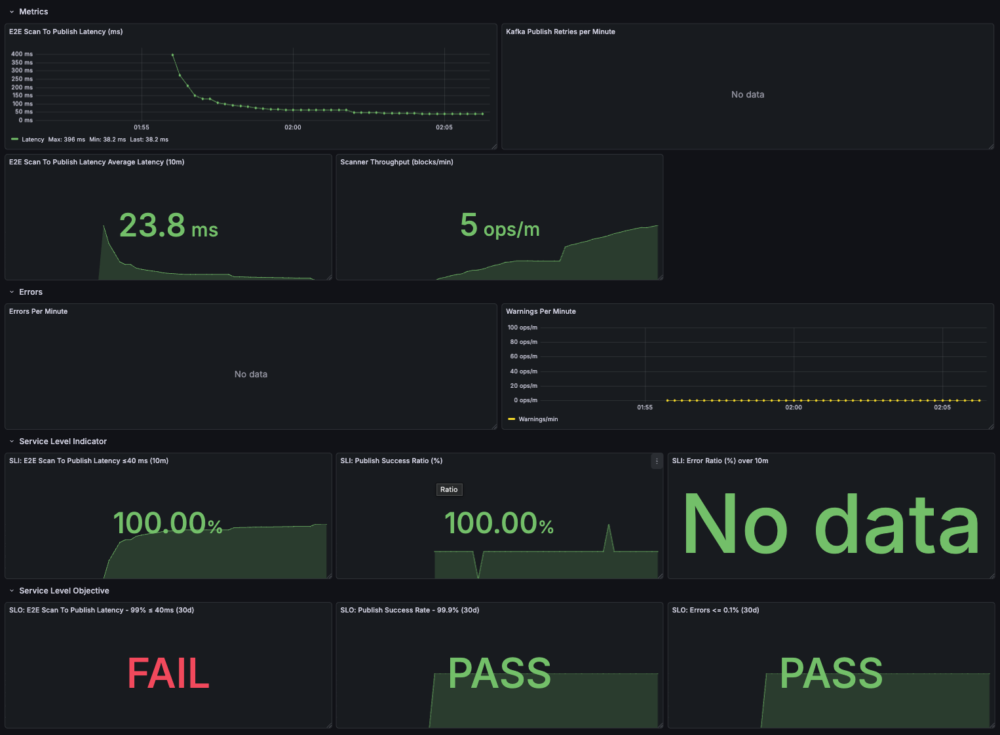
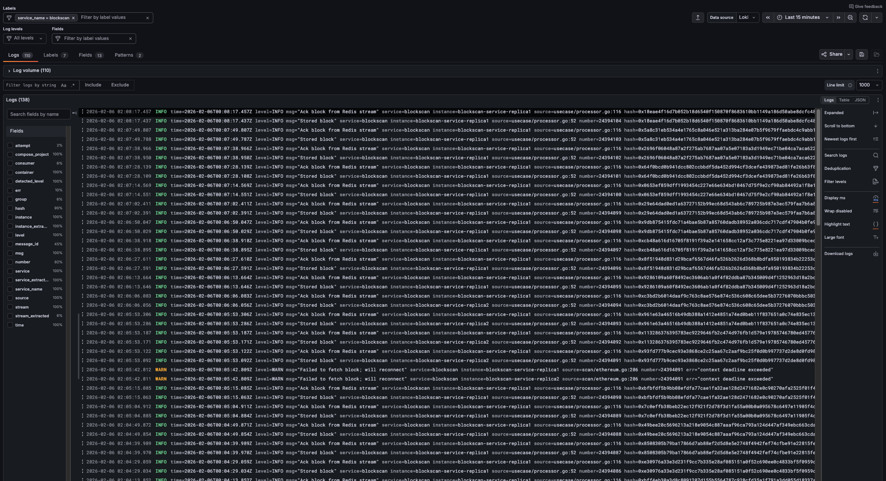

# Blockscan-service

## Description

**Blockscan** is a production‑ready microservice that ingests Ethereum blocks and reliably
publishes them to Kafka. It supports both **low‑latency** streaming of **new heads** and
reorg‑safe ingestion of **finalized** blocks, enabling diverse downstream use cases. For now,
it uses an Alchemy WebSocket endpoint to read new blocks (configurable).

The service is **reliable** by design, it provides **effectively‑once** delivery with idempotent
publishing and deterministic per‑key ordering, tolerates node/broker outages with
bounded **retries** and **graceful recovery**, and **preserves** progress across **restarts**. 

It offers a simple failover (active‑active) mechanism based on two replicas, and provides observability metrics,
logs, and health endpoints for operational clarity. Designed to be simple to integrate
and safe to operate, Blockscan service is a robust foundation for real‑time pipelines,
analytics, and indexing workloads.

## Contents

- [Quick Start](#quick-start)
  - [Prerequisites](#prerequisites)
  - [Configure Ethereum node](#configure-ethereum-node-recommended)
  - [Start the stack](#start-the-stack)
  - [Access the services](#access-the-services)
  - [Monitor the pipeline](#monitor-the-pipeline)
  - [Stop and clean up](#stop-and-clean-up)
- [Architecture](#architecture)
  - [Why Redis?](#why-redis)
  - [E2E Flow](#e2e-flow)
- [Testing](#testing)
- [Monitoring & Observability](#monitoring--observability)
- [Golang pprof](#golang-pprof)
- [Support Us!](#support-us)
- [License](#license)

## Quick Start

### Prerequisites
- Go 1.25
- Docker Desktop (Compose v2) or Docker Engine + Compose plugin
- Internet access (default Ethereum WS endpoint is public: `wss://ethereum.publicnode.com`)
- Open local ports: 6379, 9092, 8080, 3000, 9090, 6380, 18081, 18082

### Configure Ethereum node (recommended)
For consistent throughput and fewer rate limits, use an Alchemy WebSocket endpoint instead of the default public endpoint.

Create an account and app: https://dashboard.alchemy.com (choose the network: Mainnet, Sepolia, etc.).

Copy the WebSocket URL (for example: `wss://eth-mainnet.g.alchemy.com/v2/<YOUR_API_KEY>`).

Export it before starting the stack so Compose passes it to both replicas:
  macOS/Linux:
    ```sh
    export BSCAN_SCANNER_WEBSOCKET_URL=wss://eth-mainnet.g.alchemy.com/v2/<YOUR_API_KEY>
    ```
  Windows (PowerShell):
    ```sh
    $Env:BSCAN_SCANNER_WEBSOCKET_URL='wss://eth-mainnet.g.alchemy.com/v2/<YOUR_API_KEY>'
    ```
  If the stack is already running, apply the change to app replicas:
    ```sh
    make infra-blockscan-restart
    ```

### Start the stack
From the repository root, provision and start everything:
  ```sh
  make infra-up
  ```
Check status:
  ```sh
  make infra-ps
  ```
Tail app logs:
  ```sh
  make logs-replica1
  ```

### Access the services
- App (replica1): `http://localhost:18081/health` and `http://localhost:18081/metrics`
- App (replica2): `http://localhost:18082/health` and `http://localhost:18082/metrics`
- Redis Commander: `http://localhost:6380` — browse keys (dedup markers) and the `blocks` stream; the `add_block` function is auto‑loaded by the provisioner.
- Kafka UI: `http://localhost:8080` — open cluster “local” and inspect the `block-upstream-topic` to view published records (broker available at `localhost:9092` for client tools).
- Grafana: `http://localhost:3000` (user `admin`, password `admin`) — explore logs (Loki) and create metric panels using `blockscan_`‑prefixed metrics (for example, `blockscan_pipeline_end_to_end_latency_ms`).
- Prometheus: `http://localhost:9090` — query service metrics directly.

### Monitor the pipeline
- Logs: in Grafana (Loki) filter by `service=blockscan` and `instance` to follow activity
- Metrics: in Grafana, open the Blockscan Insights and Blockscan Container Metrics dashboards to track end‑to‑end latency, throughput, and Kafka publish metrics; use Prometheus for ad‑hoc queries
- Health: check `/health` and `/metrics` on each replica; Kafka UI shows topic activity

### Stop and clean up
Stop and remove containers and data volumes:
  ```sh
  make infra-down
  ```

[Back to top](#contents)

## Architecture

The Blockscan microservice adopts **Clean Architecture**, a framework‑agnostic core (entities, ports, use cases),
adapters that implement those ports — Ethereum scanner, Redis store/stream, and Kafka publisher —
and infrastructure that wires configuration, an HTTP server, metrics, and lifecycle.
At runtime, the scanner ingests blocks (new heads or finalized) and maps them to domain models;
a Redis outbox enforces deduplication and durable handoff via streams; a stream reader publishes to Kafka
and acknowledges messages on success. Components are loosely coupled for testability, scalability, and operability.

**Architecture diagram**:



### Why Redis?

Redis serves as a reliability gate ahead of Kafka. We enforce deduplication with a TTL‑scoped `SET NX` and atomically enqueue via a server‑side
Redis Function (Lua) (FCALL add_block) that acquires the dedup key and issues XADD, rolling back the key on failure. A durable published
marker is then written, and the stream entry is acknowledged only after Kafka publish succeeds, delivering **effectively‑once** semantics across
restarts and failovers without double‑publishing. 

In practice, Redis writes complete at sub‑millisecond **p50** (<1 ms in‑DC), whereas Kafka
produces with acks=all typically see multi‑millisecond p50 (~5–15 ms depending on batching/replication), so buffering through Redis keeps
ingest latency low while preserving downstream durability.

### E2E Flow

From Ethereum ingestion to Kafka publish:
- Scanner fetches new heads/finalized blocks with backoff and timeouts.
- BlockLogger invokes Redis `FCALL add_block` (Lua) to dedup (`SET NX`) and `XADD` to the stream **atomically**.
- Stream reader drains/reclaims the consumer group **PEL**, checks the published marker, publishes to Kafka (retries/txn), then writes the marker and acknowledges.
- Restarts and failovers resume from Redis, achieving **effectively‑once** without **double‑publishing**.

**E2E flow diagram**:



[Back to top](#contents)

## Testing

We prioritize reliability with integration tests that use deterministic failure injection, not just unit tests. The end‑to‑end pipeline
guarantees—deduplication, atomic enqueue, idempotent publish, and clean recovery—depend on cross‑component behavior best validated end to end.

Tests run real dependencies via Testcontainers (Redis, Kafka, and a local Ethereum dev node) and execute the service in a failpoint‑enabled
container (build/Dockerfile.test). We use PingCAP Failpoint to simulate crashes at precise boundaries, proving no duplicates and safe
reclamation of pending entries.

When iterating on stateful tests, run:
```sh
go test ./... -count=1
```

[Back to top](#contents)

## Monitoring & Observability

We added logs, metrics, and a small set of **SLIs/SLOs** to give continuous, outcome‑oriented evidence that the pipeline is healthy. Rather
than instrumenting every internal detail, we focus on signals users feel, how fast a block moves end‑to‑end, how reliably it gets published,
and whether the service is keeping up without errors. 

End‑to‑end latency shows when the system slows or backpressure builds; the publish
success rate reflects delivery reliability and catches issues that threaten effectively‑once guarantees; throughput and error rates show
capacity, headroom, and stability over time. These baselines make alerts meaningful (e.g., burn‑rate alerts on success, thresholds on latency),
help teams spot regressions early, and shorten time‑to‑root‑cause by correlating metrics with logs in **Grafana**. 

The same foundation can be
extended with tracing to follow individual requests across scanner → Redis → Kafka when deeper analysis is needed.
    
**Blockscan Insights dashboard**:



Logs complement these signals by providing narrative context when behavior changes. We emit structured, context‑rich entries that make 
it easy to follow a block through the pipeline, correlate spikes in latency or errors, and quickly isolate the component involved. 
The ready‑to‑use **Grafana** views over **Loki** support fast filtering, tailing, and side‑by‑side comparison during incidents and performance investigations.

**Blockscan logs dashboard**:



[Back to top](#contents)

## Golang pprof

**Pprof** is gated behind a dedicated config flag to keep the debug surface off by default, 
avoid accidental exposure in production, and control any profiling overhead. Operators can enable it only when needed (e.g., 
during investigations or load tests), bind it to an internal address, then disable it again without changing binaries. 
This separation supports least‑privilege and compliance needs across environments while keeping the default runtime small and safe.

Configuration files: edit `pprof.enabled` and `pprof.addr` in the relevant preset — local runs: `configs/local.yml`, Docker Compose: `configs/docker.yml`, tests: `configs/test.yml`.

Enable pprof via config (`pprof.enabled: true`); by default it serves on `pprof.addr` (local: `127.0.0.1:6060`, in Docker: `0.0.0.0:6060` inside the container).

Open the web index to browse profiles: `http://<host>:6060/debug/pprof/`.

Capture a 30s CPU profile:
  ```sh
  go tool pprof http://<host>:6060/debug/pprof/profile?seconds=30
  ```
Inspect the heap profile:
  ```sh
  go tool pprof http://<host>:6060/debug/pprof/heap
  ```
In Docker, the pprof port is inside the container; either exec and port‑forward temporarily, or run the service locally (`go run ./cmd`) to access `127.0.0.1:6060` directly.

[Back to top](#contents)

## Support Us!

If this project helps you build reliable block‑ingestion pipelines, or you like it, please **star** the **repository** on **GitHub** and consider leaving a brief review. 
Your support helps others discover the project and guides our roadmap. Thank you for trying Blockscan and sharing what works and what we can improve.

[Back to top](#contents)

## License

This project is licensed under the Apache License, Version 2.0. See `LICENSE` for details.
