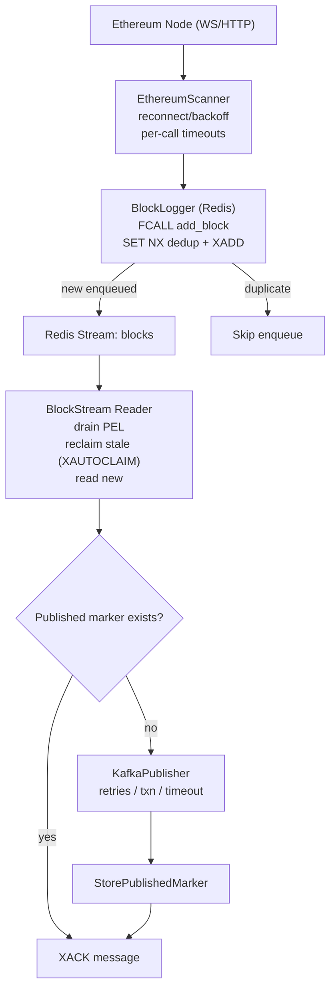

# Blockscan Ethereum Service – Ingestion to Kafka Flow

```mermaid
flowchart TD
  A["Ethereum Node (WS/HTTP)"] --> B["EthereumScanner<br/>reconnect/backoff<br/>per-call timeouts"]
  B --> C["BlockLogger (Redis)<br/>FCALL add_block<br/>SET NX dedup + XADD"]

  C -- "new enqueued" --> D["Redis Stream: blocks"]
  C -- duplicate --> J["Skip enqueue"]

  D --> E["BlockStream Reader<br/>drain PEL<br/>reclaim stale (XAUTOCLAIM)<br/>read new"]
  E --> F{"Published marker exists?"}

  F -- yes --> I["XACK message"]
  F -- no --> G["KafkaPublisher<br/>retries / txn / timeout"]
  G --> H["StorePublishedMarker"]
  H --> I
```
