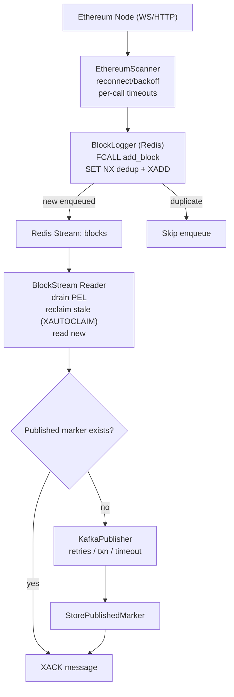

# Blockscan Ethereum Service – Ingestion to Kafka Flow

Notes:
- Deduplication happens atomically inside the Redis function `add_block` using `SET NX` followed by `XADD`.
- The stream reader drains its own PEL, reclaims stale messages from other consumers, and processes new entries.
- Before publishing to Kafka, the service checks a durable published marker; on success it records the marker and acknowledges the message.
